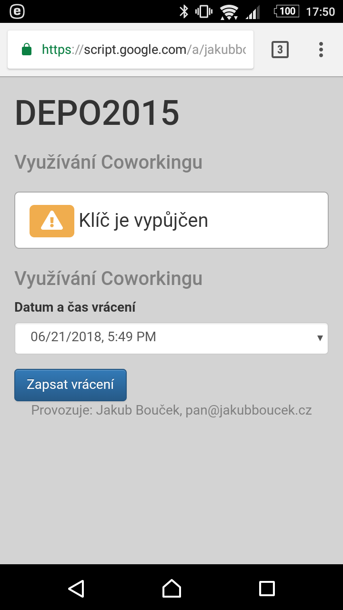
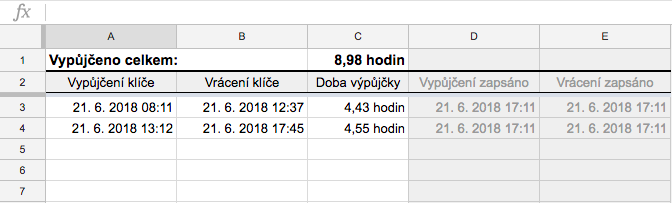

# Simple timetracker in Google Script

Velmi jednoduchý nástoj pro trackování času. Zobrazí se jako webová stránka s možností zapnout/vypnout počítání času,
výsledky se ukládají do Spreadsheet tabulky.

## Instalace
1. Vytvořte nový [Google Script](https://script.google.com/) a to buď jako:
    - script připojený ke Spreadsheetu (tzv. [Container-bound script](https://developers.google.com/apps-script/guides/bound)), nebo
    - samostatný script (tzv. [standalone script](https://developers.google.com/apps-script/guides/standalone))
2. Do těla scriptu dejte obsah souboru [Code.js](src/Code.js)
3. Přidejte do [projektu nový Html soubor](https://developers.google.com/apps-script/guides/html/#create_html_files) a nazvěte jej `Index`.
4. Do těla Html souboru vložte obsah souboru [Index.html](src/Index.html#L90)

Pokud jste v 1. bodu vytvořili script jako samostatný script, je potřeba [na konec scriptu](src/Code.js:90) zadat URL vašeho Spreadsheetu,
kam se budou data zapisovat.

Jako podklad pro vytvoření Spreadsheetu můžete použít tento vzor:
**[Simple Time Tracking Template](https://docs.google.com/spreadsheets/d/12Rna1vOLtkHnD-W_nCKY3xUKJSz8OluVfRbLDtlMOV4/edit)**.
Spreadsheet může být jakýkoliv, script zapisuje výstup do prvního volného řádku. 

## Deploy
Připravený script [vydeployujte jako Web app](https://developers.google.com/apps-script/guides/web#deploying_a_script_as_a_web_app).

# Snímky

